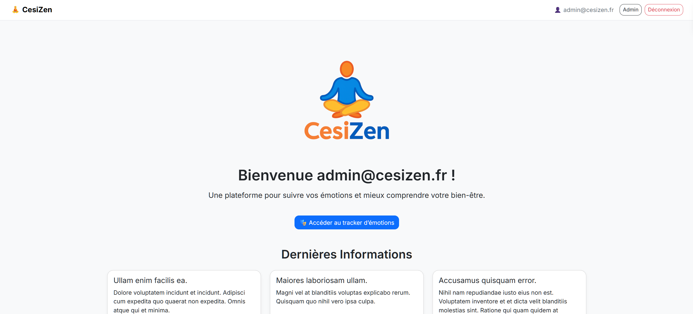
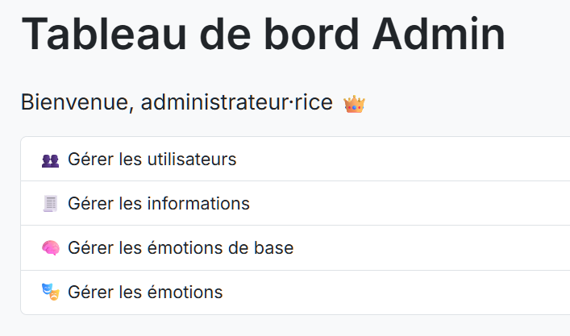
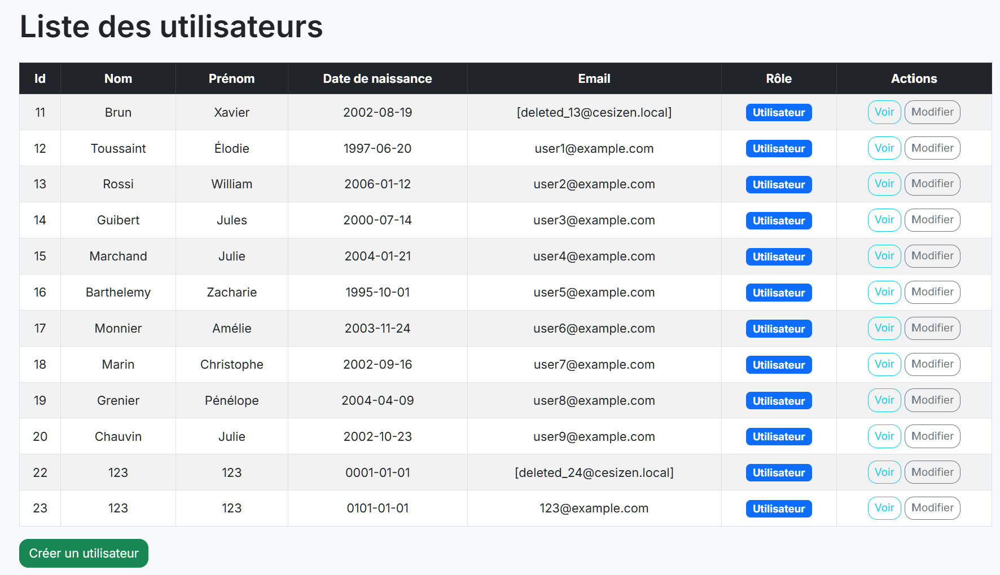

# CesiZen - web platform for tracking, analysing and visualising mental-wellbeing data

CesiZen is a proof-of-concept **web platform for tracking, analysing and visualising mental-wellbeing data**.  
Users can quickly log emotions, keep a private journal and review trends; administrators manage reference tables and user accounts. The project was built as a school assignment and intentionally focuses on **simplicity, data security and RGPD compliance**.

---

## Key features
| Domain | What it does |
|--------|--------------|
| Emotion tracker | CRUD on emotion entries (date, base emotion, optional note) visible only to the owner |
| Journal & report | Personal journal view and emotion summaries over a chosen period :contentReference |
| Profile management | Update/delete account or *anonymise* (strip e-mail & password while keeping historical data) |
| Admin dashboard | ROLE_ADMIN interface for managing users, emotions & base emotions |
| Secure auth | Form login with hashed passwords, role-based authorisation (ROLE_USER / ROLE_ADMIN) configured in `security.yaml` |

Next steps: native mobile client, favourites module, and UX/UI polish.

---

## Architecture in a nutshell

* **Symfony 6** – controllers, Twig views and Doctrine entities  
  *Main domain entities*: `Utilisateur`, `UtilisateurInfo`, `Journal`, `Entree`, `Emotion`, `EmotionBase`
* API-ready controllers expose JSON where needed (e.g. for future mobile app).  
* Database migrations handled via Doctrine Migrations; sample MySQL/MariaDB schema provided.  
* Role-based access control enforced server-side; templates adjust navigation according to authentication state.

---

## Tech stack

| Layer        | Choice                            |
|--------------|-----------------------------------|
| **Backend**  | PHP 8.1 + Symfony 6, Doctrine ORM | 
| **Frontend** | Twig, Webpack Encore, SCSS, Bootstrap 4 (SB-Admin-2) |
| **Database** | MySQL / MariaDB                  | 
| **Testing**  | PHPUnit & Symfony Test Pack       | 
| **Dev-ops**  | Docker Compose   | 

## 📸 Screenshots

| Accueil | Tableau de bord admin | Liste des utilisateurs |
|---------|----------------------|--------------------|
|  |  |  |
